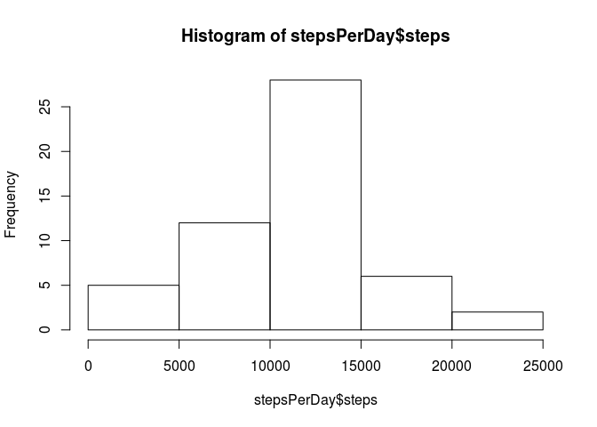
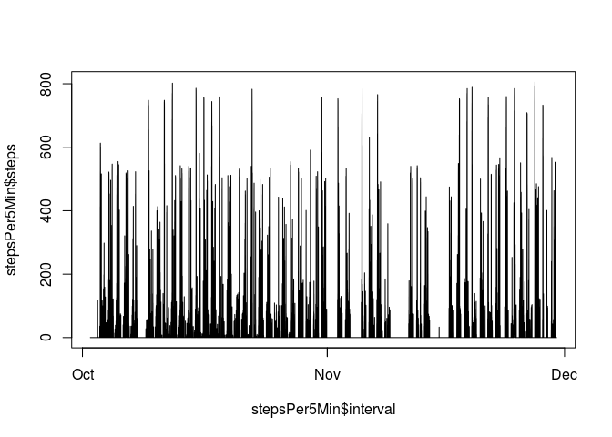

# Reproducible Research: Peer Assessment 1


## Loading and preprocessing the data


```r
data<-read.csv("activity.csv", na.strings="NA")

#Convert the Date and Time variable to Date/Time classes
data$date=as.Date(data$date, format='%Y-%m-%d')#4. Convert the Date and Time variable to Date/Time 
```


## What is mean total number of steps taken per day?


```r
stepsPerDay<-aggregate(steps ~ date, data, FUN = sum)
hist(stepsPerDay$steps)
```

\

```r
mean(stepsPerDay$steps)
```

```
## [1] 10766.19
```

```r
median(stepsPerDay$steps)
```

```
## [1] 10765
```


## What is the average daily activity pattern?


```r
stepsPer5Min<-setNames(aggregate(steps ~ paste(date,sprintf("%04d", data$interval)), data, FUN = sum), c("interval", "steps"))
stepsPer5Min$interval<-as.POSIXct(stepsPer5Min$interval, format='%Y-%m-%d %H%M')
plot(x=stepsPer5Min$interval, y=stepsPer5Min$steps, type="l")
```

\


## Imputing missing values


## Are there differences in activity patterns between weekdays and weekends?
